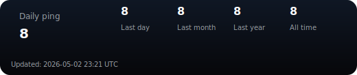

# discord_site

## Daily Ping widget

На странице [daily_ping/index.html](daily_ping/index.html) добавлен тёмный виджет, который получает данные с https://pollpi.slavi.workers.dev/daily_ping и отображает счётчики (Last day, Last month, Last year, All time).

Пример встраивания (используйте URL вашего GitHub Pages или другого хоста):

```html
<iframe src="https://Zlaoslav.github.io/discord_site_frontend/daily_ping" width="520" height="140" frameborder="0" scrolling="no"></iframe>
```

GitHub (README) — картинка-бейдж

В репозитории автоматически создаётся SVG-бейдж `daily_ping/badge.svg`. Вставьте в `README.md` простую ссылку на изображение:

```md

```

Альтернатива (полный raw-url):

```md

```

Workflow в `.github/workflows/update_daily_ping_badge.yml` обновляет бейдж автоматически каждый час.